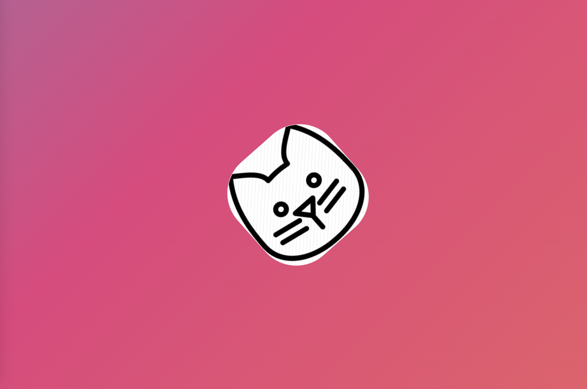

## Meowbourne

This is a side project for our team internal usage based on the concept of `transfer learning`.

[Link: How can Transfer Learning be a blessing in deep learning models?](https://towardsdatascience.com/how-transfer-learning-can-be-a-blessing-in-deep-learning-models-fbc576dc42)

Transfer Learning is a technique in which a model that is trained on a certain task can be used to make predictions for another task based on its learning (weights).

- `Use expert models`: Using Transfer Learning, we can directly use models that are carefully and efficiently created by experts by just freezing the parameters and changing the output layer.

- `No model structure development`: As we are using already existing models, we no longer need to think about the layers to be included, what parameters should be assigned and more.

- `Higher and better performance`: As the models used in transfer learning are carefully designed, they perform better on other similar tasks as well.

quick for training: 2389 cat & kitten pictures, 10 Epochs, only 8 mins.

### Tech Stack

- 1:

  1. Use `Tensorflow` to build up a transfer learning maching learning model, which aims to predict the breed of a cat picture.

  2. Use Flask to build up several apis to encapsulate the prediction feature.

  3. Use Docker to containerize the service for further deployment usage.

- 2:

  1. Build a `python Scrawler` script that able to fetch all the current available cat information if possible(including name, age, picture, etc.), mainly rely on **RSPCAVIC**. If not possibile, manually get data at this stage.

  2. Integrate the function with `Flask`

  3. Front-end setup with `React.js` to demonstrate the data and functionalities.

  4. Dockerize the front-end project, apply `docker-compose`

- 3:

  1. Deploy the repo to AWS EC2 instance.

#### Start Page

#### Fetching Data

#### Home Page

#### Predict Result

## Future Parts:

Roughly spent two evening on this project, so it is really simple and straight forward.

If have time, can decouple the services into serverless features.

- AWS API Gateway
- lambda
- ElasticCache
- SageMaker

Potential Enhancement:

- Cognito //Auth
- SQS //Message queue
- VPC
